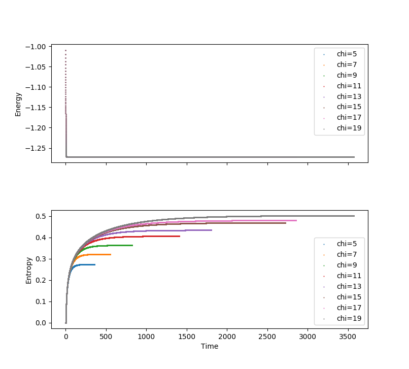
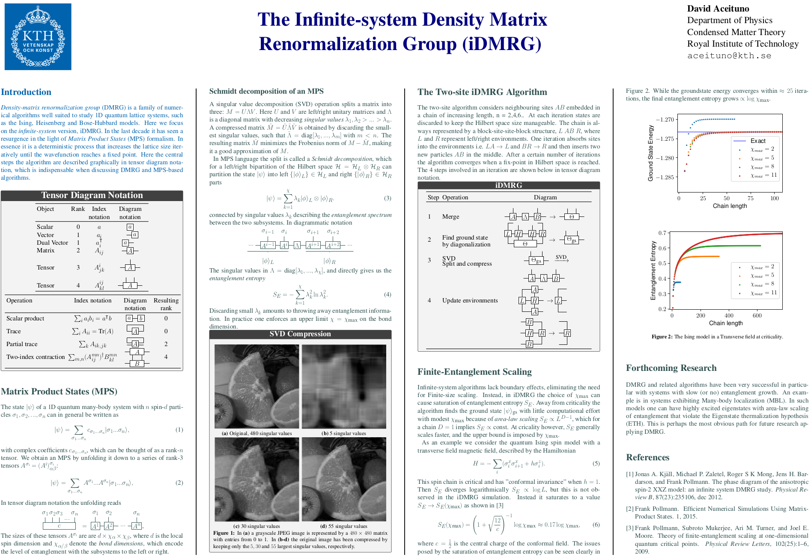
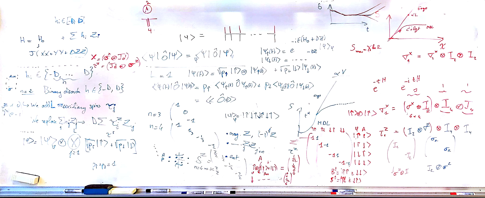

# 2017

## Half of January

* Started on exact diagonalization of the quantum Ising spin model, using C++ with the Eigen math-library
* Started Many Particle Physics course

## February

* Worked with Many Particle Physics HW problems.
* Started a new course: FSI3000 History of physics and epistemology, 5 hp.
* Review of entanglement and entanglement measures
* Continued work on exact diagonalization. See [dropbox paper](https://paper.dropbox.com/doc/Exact-Diagonalization-Zs6dbUNX7xyvmrUqgLzBt).
* Learned about different software for diagonalization in C++. Nice find: [Spectra](https://github.com/yixuan/spectra). Main takeaway: large matrices are really slow to diagonalize, one is basically limited just a few eigenvalues (largest/smallest algebraic or absolute values), and even then it becomes intractable.

  ​


## March

* Last work on Many Particle physics HW problems and its final presentation. Got an A! Yay! Incidentally, the last HW, a presentation-problem, was about the analytic solution to the quantum Ising spin model.
* Finished the review of entanglement by doing some exercies See [dropbox paper](https://paper.dropbox.com/doc/Entanglement-27fQY5yNn6Lsrcm5LRFB0). 
* More serious look at Schollwöck's paper. Tried to grasp the notation and possible implementation of  Schmidt decomposition. 
* Tried doing minimal examples of successive Schmidt decompositions by hand, with two or three "bit"-particles. Confusion ensued. The explanations by Pollman's and Schollwöck lack some intermediate steps or are unclear, for what happens between each Schmidt-iteration. [See GitHub paper](https://stackedit.io/viewer#!url=https://raw.githubusercontent.com/DavidAce/Notebooks/master/MPS/MPS.md). (It probably has some errors)
* Explored note-taking software. Result: Markdown+Latex (Mathjax/Katex) works great. Math can be copy-pasted into latex if needed. Dropbox paper has a limited version of this. Better to use Typora, ReText or StackEdit (online). Tried Jupyter briefly but I don't think it's the correct tool yet. Another promising programming notebook: [Beaker](http://beakernotebook.com/), if it could only just work... check in the future.

  ​

## April

* Looked at other software packages to see if I could reproduce results from these. [ITensor](http://itensor.org/) stood out, but it is kind of slow according to Jens. Still, it is good to keep around to compare results and get hints on implementation.
* Started to implement a simplest case scenario of MPS decompositon. Basically this step:
$$
\begin{aligned}
c_{\sigma_1,\sigma_2...\sigma_n}  = \sum_{a_1,a_2...a_{n-1}} A^{\sigma_1}_{a_1}A^{\sigma_2}_{a_1,a_2}...A^{\sigma_n}_{a_{n-1}}
\end{aligned}
$$
​	for an arbitrary tensor $c$. As usual this is done in C++ with the Eigen's math library.
* A discussion with Jens sorted out the confusion I had about " tensor flattening". Also, between successive Schmidt decompositions the resulting matrices from the SVD need to be interpreted as tensors properly. Before continuing to the next step. This was the missing piece.


## May

* Prepared a presentation for the course FSI3000
* [Found a great book that clarified a lot](http://www.springer.com/in/book/9783319142517). Basically I want the Vidal Canonical form $\Gamma \Lambda \Gamma \Lambda...$ so I can get any $A$ (left-canonical) or $B$ (right-canonical) form later.  
* Succeeded in correctly interpreting $U$ and $V$ matrices as tensors after each SVD.
* Small victory: Truncating the SVD down to $\chi$ was quite simple. 
* After correctly understanding storage orders and a related bug with RowMajor in Eigen's implementation of SVD, all my problems were gone. The MPS decomposition is finally correct for an arbitrary tensor state. 
* Checked out the Julia programming language for. **If C++ becomes too cumbersome, Julia is a good option!!**
* Nice find: [RedSVD](https://code.google.com/archive/p/redsvd/) can do SVD quickly on huge matrices using a randomized algorithm.
* Started working on implementing TEBD. [Pollmann's](http://quantumtensor.pks.mpg.de/wp-content/uploads/2016/06/notes_1.pdf) paper is great at explaining this conceptually. I am mainly copying to C++ the steps in itebd.py by Jens and Frank Pollmann, while checking the steps in the paper.
* Somewhat distracted by the last solid mechanics exam.


## June

###  Week 1

* Continued working on iTEBD work on C++. Some minor takeaways: 

  * Matrix exponentials are available in Eigen::Core for regular Matrix types, and not for Tensors. Luckily I've already written an interface to switch between these types.
  * I finally understood all the reshapes and transposes (shuffles) of indices and why they were needed. Example: Say we want to obtain $\theta^{jk}_{\alpha\gamma}$ from the contraction $ A^j_{\alpha\beta}B^k_{\beta\gamma}$. Then we do $ A^j_{\alpha\beta}B^k_{\beta\gamma} = \{\text{contract} [2,1]\} = \tilde{\theta}^{j\alpha}_{k\gamma} =  \{\text{shuffle} [0,2,1,3]\} = \theta^{jk}_{\alpha\gamma} $.
  * Found that it was much clearer to work with the $\Gamma^A \Lambda^A\Gamma^B \Lambda^B$ -notation as in the paper, instead of the $B^AB^BB^C$ notation in the original iTEBD.py code.

* Finally got the same ground state result as in iTEBD.py! YAY!

  ​

### Week 2

* C++ vs Python showdown! I did time comparisons using exactly the same settings. Subsections the code were timed as well.  The settings for the table below were: 
   * On my laptop, 3 runs, 10000 iterations each, $\chi = 15$.  
   * C++ compiled with -O3 -march=native (gcc 6.3.0)
   * SVD using Eigen::BCDSVD() (Bidiagonal Divide and Conquer SVD). This is expected to scale much better with increasing matrix size compared to Eigen::JacobiSVD().
   * Python3, version 3.5.2.

The runtime differs by a factor ~4.3. However the SVD section, which differs by a factor ~1.6, is expected to scale worse than the others as $\chi$ increases, and it is not clear yet if this factor remains constant.

|                                     | C++  [s]                    | Python  [s]                 |
| ----------------------------------- | --------------------------- | --------------------------- |
| SVD                                 | 0.890 \| 0.898 \| 0.893     | 1.487 \| 1.496 \| 1.485     |
| Time evolution $U(\delta t)\theta$  | 0.277 \| 0.282 \| 0.272     | 1.460 \| 1.479 \| 1.452     |
| Reshaping SVD results               | 0.061 \| 0.064 \| 0.062     | 1.281 \| 1.310 \| 1.288     |
| Update $\Gamma$  (or $B$ in python) | 0.085 \| 0.086 \| 0.085     | 1.202 \| 1.242 \| 1.210     |
| **Total**                           | **1.316 \| 1.333 \| 1.315** | **5.695 \| 5.795 \| 5.701** |

---

* Tried out [RedSVD](https://code.google.com/archive/p/redsvd/). Specifically [a header version on github](https://github.com/ntessore/redsvd-h). I can't get it to work properly. The usage is very simple, almost identical to Eigen, but I only get `nan` as a result. In any case, it seems like the performance is only excellent for low-rank approximations of sparse matrices, i.e. when the rank of the decomposition k << n, where n is a  linear size of the matrix. Otherwise it performs similarly or worse, if I understand correctly.

* Discovered [RStudio](https://www.rstudio.com/) (free/open source/win-linux-osx) with support for R Markdown and R Notebook documents. While I don't intend to learn R language, RStudio is also a powerful (R)Markdown editor. Using knitr + pandoc in its back-end, it has full latex support (not only math!), as well as C++ and Python integration so that code chunks can be executed mid-text, similar to Jupyter. 

* Relearned Tikz/PGF to make pretty tensor diagrams. Made a [`tensorgraphics.sty`](https://github.com/DavidAce/Notebooks/blob/master/Code%20examples/Tensors/tensorgraphics.sty) file to easily import them in latex preamble with `\usepackage{tensorgraphics}`. The usage is basically
  * Tensor of rank 2: `\tensorII{name}{left index}{right index}`
  * Tensor of rank 3: `\tensorIII{name}{physical index}{left index}{right index}`
  * ... And so on. See more in the [code examples](https://github.com/DavidAce/Notebooks/tree/master/Code%20examples/Tensors).


* Started work on iDMRG


### Week 3

* My iDMRG code compiles and runs fine. However, the eigenvalue engine `Spectra` is not working correctly: it gives me completely wrong eigenvalues from the start, and arrives at an incorrect ground state energy. Perhaps I'm using it wrong. It's usage is very similar to scipy eigsh. Not all eigenvalue solvers allow one to define the matrix-vector product (most want you to supply a matrix), so it may be somewhat cumbersome to try another solver.

* Realized that the $B^A B^B B^C$ notation in `itebd.py` and `idrmg.py` was actually Hastings suggestion for improving numerical stability, mentioned in:

  > [1] Hastings, M B. 2009. “Light Cone Matrix Product.” Interpreting 87545: 15. doi:10.1063/1.3149556. Page 5-6

  and

  > [2] Schollwoeck, Ulrich. 2010. “The Density-Matrix Renormalization Group in the Age of Matrix Product States.” Annals of Physics 326 (1): 96–192. doi:10.1016/j.aop.2010.09.012. Page 84-85.

  **However**, in the update there's still an inverse multiplication! Why?

  ```python
  X = np.transpose(np.tensordot(np.diag(s[ia] ** (-1)), X, axes=(1, 1)), (1, 0, 2))
  B[ib] = np.tensordot(X, np.diag(s[ib]), axes=(2, 0))
  ```
  Which essentially amounts to $B^A = (s^A)^{-1} X s^B$, equation 18 in [1], which is exactly what we were trying to avoid! Instead we should just have the lines

  ```python
  Z = np.transpose(np.reshape(Z, (chi2, d, chic)), (1, 0, 2))
  B[ib] = np.tensordot(C, Z.conjugate(), axes=([1, 3], [0, 2]))
  ```

  I.e., equation 19 in [1]. 

  **Unfortunately**, this gives me completely inaccurate results... Have I misunderstood Hastings paper? Schollwöcks paper seems to agree with me, in eq. 274 in [2].


### Week 4

* Solved the problem with Hastings trick for numerical stability. The wavefunction B has to be normalized using the same factor as for $\Lambda^A$. This is not explained clearly in Hastings or Schollwöcks papers, but was clear in TenPyLight.
* Resolved issue with eigensolver. Basically in the user-provided function `perform_op` for Spectra, the contents of my vector needed to be moved into the C-style array `double *y_out` using `std::move` and not the assignment operator `=` . iDMRG is now working.


## July

### Week 1

Vacations.

I've read some papers:

-----

**Paper 1**: 

> Schindler, Frank, Nicolas Regnault, and Titus Neupert. 2017. “Probing Many-Body Localization with Neural Networks,” April, 1–11. http://arxiv.org/abs/1704.01578.


Very clear exposition on the MBL-ETH transition, and how neural networks work and how it aids the phase discrimination. There are some very interesting remarks here summarized:

* Several measures allow a [...] distinction of thermal and localized regimes.  [...]These include energy level statistics, level statistics analyses of the entanglement spectrum and studies of the distribution of the entanglement entropy over a region of energy eigenstates. Necessarily, these methods make several implicit assumptions about the nature of either regime or about the transition. The neural network based method for identifying the ETH-MBL transition that we present here is a priori less biased, assuming only that the information for distinguishing the ETH from the MBL regime is – in some form – contained in the entanglement spectrum. This is useful in particular in situations where the physical characteristics of a phase are not fully understood, as one may certainly argue to be the case for MBL. Thus, the neural network approach also allows for the possibility of finding ways of characterizing the phase transition beyond established methods.

* In between the two limits, the behavior of a specific system being either ETH or in MBL depends on the specific disorder realization and the eigenstate that is considered. Averaging over disorder realizations removes these dependences, but the transition between ETH and MBL regimes may still depend on the energy density at which the system is probed, which amounts to the existence of a many-body mobility edge. In addition, an intermediate regime, the so-called Griffith phase may be present. 

* Several possibilities have been explored to determine from the entanglement properties whether a state $|\psi\rangle$ at finite energy density and fixed disorder shares the character of the
  MBL or ETH regime. 

  1. The “Schmidt gap” $\lambda_1(\rho_A) - \lambda_2(\rho_A)$, where $\{\lambda_j(\rho_A); \lambda_j \geq \lambda_{j+1} \}$ denotes the spectrum of $\rho_A$.
  2. ETH states have volume-law entanglement scaling, while MBL states have area-law entanglement scaling.
  3. The standard deviation $\sigma_E$ of a sample of entanglement entropies.
  4. The level spacings in the entanglement spectrum follow distinct statistical distributions in the ETH and MBL regimes.

  ​


-----


 **Paper 2**

> Carleo, Giuseppe, and Matthias Troyer. 2017. “Solving the Quantum Many-Body Problem with Artificial Neural Networks.” *Science* 355 (6325): 602–6. doi:10.1126/science.aag2302.


Clear on certain aspects of the neural network approach. I do not understand Fig.2, which seems important. They call these "feature maps"... what is that?


Some interesting parts:

* In this case, RBM artificial networks are constituted by one visible layer of N nodes, corresponding to the physical spin variables in a chosen basis (e.g., $\mathcal{S} = \sigma_1^z,...,\sigma_N^z)$ and a single hidden layer of M auxiliary spin variables $(h_1,...,h_M)$ (Fig. 1). This description corresponds to a variational expression for the quantum states

  $$\Psi_M(\mathcal{S};\mathcal{W}) =\sum_{\{h_i\}} e^{\sum_j a_j \sigma_j^z + \sum_i b_ih_i + \sum_{ij} W_{ij}h_i\sigma_j^z} $$

  where $h_i = \{-1,1\}$ is a set of $M$ hidden spin variables and the network parameters $\mathcal{W} = \{a,b,W\}$ fully specify the response of the network to a given input state $\mathcal{S}$. Because this architecture features no intralayer interactions, the hidden variables can be explicitly traced out, and the wave function reads.

  $$\Psi_M(\mathcal{S};\mathcal{W}) =\sum_{\{h_i\}} e^{\sum_j a_j \sigma_j^z} \times \prod_{i=1}^M F_i(\mathcal{S})$$

  where $F_i(\mathcal{S}) = 2\cosh [b_i+\sum_jW_{ij}\sigma_j^z]$. The network weights are, in general, to be taken complex-valued to provide a complete description of both the amplitude and the phase of the wave function.


* One of the practical advantages of Neural-network quantum states (NQS) is that its quality can, in principle, be systematically improved by increasing the number of hidden variables. The number $M$ (or, equivalently, the density $\alpha =M/N$ then plays a role analogous to the bond dimension for the MPS. However, the correlations induced by the hidden units are intrinsically nonlocal in space and are therefore well suited to describe quantum systems in arbitrary dimension.
* [...] deep network architectures and convolutional neural networks, can constitute the basis of more advanced NQS and therefore have the potential for increasing their expressive power. Furthermore, the extension of our approach to treat quantum systems other than interacting spins is, in principle, straight- forward. In this respect, applications to answer the most challenging questions concerning inter- acting fermions in two dimensions can already be anticipated.
* Finally, at variance with tensor network states, the NQS feature intrinsically nonlocal correlations, which can lead to substantially more compact representations of many-body quantum states. A formal analysis of the NQS entanglement properties might therefore bring about substantially new concepts in quantum information theory.


### Week 2

* After communication with Jens I'll focus on two goals in the near future: Finite DMRG, and Finite entanglement scaling. In the latter, reproduce the relevant plots in: 

  > Pollmann, Frank, Subroto Mukerjee, Ari M. Turner, and Joel E. Moore. 2009. “Theory of Finite-Entanglement Scaling at One-Dimensional Quantum Critical Points.” *Physical Review Letters* 102 (25): 1–6. doi:10.1103/PhysRevLett.102.255701.


* Started work on finite-DMRG (fDMRG). It looked simple enough. 
* To implement fDMRG I've looked at 
  *  [`simple-dmrg`](https://github.com/simple-dmrg/simple-dmrg) : A program I found on Github that does **not** use MPS.
  *  [Schollwöcks](https://arxiv.org/abs/1008.3477) paper from 2011.
  *  [A doctoral dissertation thesis by Michael Sekania](https://www.physik.uni-augsburg.de/theo3/kampf/dissertationen/downloads/sekania_diss.pdf).
  *  [Density Matrix Renormalization Group for dummies](https://arxiv.org/abs/cond-mat/0603842) (without MPS). Qualitative.
  *  [Martin Jakob Ganahl's thesis](https://pure.tugraz.at/portal/files/1489405/Diplomarbeit1.pdf)
  *  [New Trends in Density Matrix Renormalization](https://arxiv.org/abs/cond-mat/0609039) (without MPS). Mostly for qualitative reading.
  *  [An introduction to numerical methods in low-dimensional quantum systems.](https://arxiv.org/abs/cond-mat/0304375) (without MPS).
* Got some mixed results. The algorithm makes sweeps, but behaves very strangely or crashes with large chi...

### Week 3

* Worked on a fluke, i.e. not really. Turns out it only worked with low chi because then the Gamma tensors are all the same sizes and can be contracted even if there's something fundamentally wrong. 
* Started work on restructuring the code. I'm rewriting it object oriented to, make it clearer and more expandable. 
* I realize some parts of the program I hadn't really understood properly. For instance, why and how the Hamiltonian MPO looks the way it does. Same goes for left/right environment tensors. Restructuring the code helped pinpoint these gaps in understanding. However I still don't exactly understand the way the Hamiltonian MPO matrix is reshaped and transposed into a useful tensor format. It simply works.
* Program does the iDMRG-part well but the fDMRG part crashes. Somehow the legs of neighboring $\Gamma^A$ and $\Gamma^B$ aren't compatible when loading them from storage.

### Week 4

* **fDMRG finally works!** There were issues when storing and loading the MPS and environments. The bookkeeping was tricky. Also, for the two-site MPS  $\Theta = \Lambda^B_{n-1} \Gamma^A_n \Lambda^A_n \Gamma^B_{n+1} \Lambda^B_{n+1}$ I had forgotten that the first $\Lambda$ is from position $n-1$ when doing finite DMRG, as opposed to $n+1$ as in iDMRG. 

  The algorithm should be clear from the commented code below:

```{c++}
// superblock contains the MPO, Left/Right environments
// and two-site MPS at the current position on the chain.

// S contains previous MPS and environments created during
// infinite-DMRG for chain lengths up to max_length.

// direction == 1 means sweep right, -1 means sweep left.

void finite_DMRG(class_superblock &superblock, class_storage &S, long sweeps){
    long direction  = 1;
    long sweep = 0;
    while(sweep < sweeps) {
      
      // Load the two-site MPS (i.e., GA, LA, GB, LB) and Left/Right
      // environments of the current position into the superblock.
      S.load(superblock); 	
      
      // Read the external bond dimensions of the superblock,
      // i.e. d, chi_a, and chi_b for a tensor Theta.
      //					  d  	d
      // Theta =	chi_a__.__|___.__|__.__chi_b
      //				   LB GA LA GB LB
      superblock.update_bond_dimensions();
      
      // Find the lowest eigenvalue and eigenstate, corresponding to ground
      // state MPS, by diagonalising the tensor network defined by Theta,
      // Left/Right environments and the Hamiltonian MPO.
      superblock.find_ground_state();
      
      // Truncate the found eigenstate using SVD decomposition, keeping "chi" singular
      // values at the bond LA depicted above.
      superblock.truncate();
      
      // Update GA, LA and GB.
      superblock.update_MPS();
      
      // Compute the energy density and compare with exact value.
      superblock.print_error();
		
      // Store MPS and environments of the current superblock to "disk"
      S.overwrite(superblock);
      
      // Move one step according to "direction" by
      //	1) enlarging left OR right environment (contraction with current MPS)
      // 	2) Storing the enlarged environment to disk
      //	3) position += direction.
      S.move(superblock, direction);

      // Turn around when reaching the end of the chain.
      if (S.position_L <= 1 || S.position_R >= S.max_length - 1) {
        direction *= -1;
      }
      
      // Increase sweep when passing by the middle of the chain.
      if(S.position_L == S.max_length/2 -1 && S.position_R == S.max_length/2){
        sweep++;
      }
    }
```


* Starting work on batch processing to study finite entanglement scaling.
* Set up a Github repository


## August

### Week 1

* HDF5
* Documentation, Doxygen.
* ​

### Week 2

* Continued Hdf5 and polishing up code structure.
* Continued on documentation.
* Wrote code to get data out of the program in hdf5 format and plot it conveniently in python. First plots are starting to emerge.


### Week 3

* Got some plots  for (non-)convergence of iTEBD, that looked like log-divergence. After discussion with Jens I realized I just needed to simulate a while longer. Then it converged properly.
* Started to check if Finite-entanglement scaling results from itebd and idmrg agree. Initially, they do not! This is very puzzling. The ground state energies agree but entropies do not!
* ​

### Week 4

* Continued checking and bug-checking to see if I can make itebd and idmrg entanglement scaling results agree. They still do not!
* Tips from Jens: Check orthogonality conditions
* Reading up on Vidal's paper on how to "canonicalize", i.e., convert any iMPS into canonical form.
* Began to prepare QM assistant exercise lecture 1.

## September

### Week 1

* Prepared QM exercise lecture 2 and 3.
* Continued implementation of orthogonalization for iMPS. Something is really wrong. The canonicalization destabilizes the computation, and it shouldn't, as far as I can tell. There are 4 suggested implementations for doing this and I've done them all: Vidal, McCulloch & Vidal 2014, McCulloch 2008, and the clearest yet by Ran, Shi-Ju, Emanuele Tirrito, Cheng Peng, Xi Chen, Gang Su, and Maciej Lewenstein. 2017. “Review of Tensor Network Contraction Approaches,” September. http://arxiv.org/abs/1708.09213


### Week 2

* Prepared QM exercise lecture 4 and 5
* Started correcting QM homework problem set 1
* Continued work on orthogonalization. I've understood many things that I've been doing wrong. For instance I hadn't understood the meaning of computing **left** eigenvectors, in a way that differs from the right ones fundamentally. This, among some misunderstandings were really hindering progress. Now I feel that I'm close to solving the issue. 


### Week 3

* QM exercise 6 and 7.
* Correcting QM homework problem set 1. This is taking a lot of time.
* Writing down answers to chapter 2 in Griffiths to put up on course webpage


### Week 4

* QM exercise 8 and 9 + computer lab. Tough week.
* Went to meet Jonas Kjäll to discuss a project idea to study the MBL/TH (mobility edge?) transition. In short, his idea is to do the smallest possible injection of a TH state into one that is clearly MBL, by swapping a column-row pair from the respective  Hamiltonians. More precisely we discussed:
   * Create a Hamiltonian that is clearly in the non-localized (ergodic) regime (perhaps a GOE matrix?) and a Hamiltonian that is clearly in MBL (perhaps an Anderson-like model with random field strengths $h_i$ at each site), and swap a column-row pair between these two Hamiltonians. Explore the characteristics of such a system, and study the possibility of getting a phase in between ergodic and localized regime.
   * Note that you should check the energy levels in the middle, if you order them after diagonalization. This is where the level spacing should be smallest.
     * Using entanglement entropy $S_E = -\text{Tr}{\rho_A} \log{\rho_A}$ as order parameter. Here $\rho_ A = \text{Tr}_B \rho_{AB} = \text{Tr}_B |n\rangle\langle n|$ is the density matrix of subsystem $A$, and $|n\rangle = $ |A>|B> = |¤¤¤...> |¤¤¤...>  is the full many body state vector of L particles "¤",  composed of subsystems A and B.
     * Apparently, according to D. Page (1993) the entropy of the thermal phase is $S_{Th} \approx \frac{1}{2}( L \log(2) - 1 )$ or something like that, whereas $S_{MBL} = \text{constant}$ due to area law scaling. 
     * We can probably look into using the Rényi entropy as an order parameter also, which to second order ($q = 2$) may be less computationally expensive than Neumann entropy ([Modak, R., & Mukerjee, S. (2015)](https://doi.org/10.1103/PhysRevLett.115.230401)). It is defined as $S_q = \frac{1}{1-q} \log \sum_{i=1}^n p_i^q $, where p_i is a probability distribution, $p_i = \text{Pr}(X=i)$. In practice the choice $q = 2$ is often used, and the studied quantity is $S_2 = - \log_2(\text{Tr}_A \rho_A(t)^2)$ . It says in [Luitz, Huveneers & de Roeck (2017)](http://arxiv.org/abs/1705.10807) that $S_2 \propto L \log 2$ for ergodic systems while $S_2 \propto $ constant if localized.

* ​

## October

### Week 1

* QM excercise 10 

* Continued work on canonicalization. This week I'm giving it everything I've got. I have tried 
  * Orus and Vidal's original approach by coarse graining (2008)
  * Phien and Vidal's iterative approach (2014)
  * Ran, Tirrito and Peng's approach that does not coarse grain but still explains how to canonicalize a two-site system.

  None of them work.


* Decided with Jens and Jonas to read two papers until next friday:
  [Luitz, D. J., Huveneers, F., & de Roeck, W. (2017). How a small quantum bath can thermalize long localized chains.](http://arxiv.org/abs/1705.10807) 
  and [Thiery, T., Huveneers, F., Müller, M., & De Roeck, W. (2017). Many-body delocalization as a quantum avalanche ](http://arxiv.org/abs/1706.09338)


### Week 2

* QM excercise 11 and 12, the last ones!! 
* Meeting with Jonas and Jens about the MBL mobility edge project.
  * Decided that I could start by checking what happens if we replace the GOE ergodic grain in the paper by Luitz, with a simple spin operator $\sigma_0^z$, so the Hamiltonian becomes: $H = \epsilon_0 \sigma_0^z + \sum \epsilon_i \sigma_i^z + \sum e^{-i/\xi} \sigma_i^z \sigma_0^z$, i.e. where $\epsilon_0$ could simply be 1, and $\epsilon_i \in [-W,W]$, either with or without bias as explained in the same paper.
  * Try to reproduce the plots in Figure 2, basically calculate the gap ratio $r = \frac{\min (\Delta E_k, \Delta E_{k+1})}{ \max  (\Delta E_k, \Delta E_{k+1}) }$ , with $\Delta E_k = E_{k+1} - E_k$.
* ​


### Week 3

* Correct HW problem set 3 in QM 
* Create a poster presentation for next week's P@K boat-conference

### Week 4
* Monday to Wednesday on P@K conference.  See my poster below.

  

* Kept working on canonicalization and some refactoring on code.


## November

### Week 1
* Had a first meeting with Axel where we discussed DMRG and canonicalization. We agreed on the following 
  1. Make a plot of $S_E$ vs iterations with $J=\pm 1$
  2. Start environments in a different way, by basically contracting into them a couple of relevant initial MPS states.
  3. Check the iterative method
  4. Check out the robust SVD
  5. Check Clang + Cmake on ny own code.
* ​
* 

### Week 2 Belgium!

* Had a lot of fun in Belgium. Had workshops on DMRG and PEPS.

### Week 3

* Learned how to compute the number of operations, or computational cost, of contracting tensor networks.
* Started computing the variance of the MPS. 

### Week 4

* Computing the variance turns out to be hard. The transfer matrices do not help much. 
* Started computing variance with moment generating functions and characteristic functions instead.
* I can get correct energy with the method above, but the variance seems wrong, way too large. I'll try computing the variance in the slow way to compare (basically keeping track of another set of environments that can be contracted with two MPO's).

## December

### Week 1
* Continued implementing variance using moment generating functions. Did some restructuring of code to have clearer file management during the weekend. 

* Discussed a new project with Loic for studying MBL with TEBD algorithms. 
  The idea is to look at a paper by Cirac for implementation of Ancillas /auxiliary particles to simulate random models that give MBL on systems that are still translationally invariant, such that we can use TEBD/DMRG. 

  

  ​

  1.  Let's say we work with the $XXZ$ model $H_0 = \sum_i J(S^X_{i} S^X_{i+1} +S^Y_i S^Y_{i+1} + \Delta S^Z_i S^Z_{i+1})$. We add an additional term $H_1 = \sum_i h_i S^Z_i$ where $h_i$ is a random field at each site, such that the total Hamiltonian becomes $H = H_0 + H_1$.

  2.  Now we follow the prescription by Cirac, where we discretize $h_i \in \{-D,..., D\}$ in $n$ levels. In what follows let's consider $n = 2$, so that we get binary disorder $h_i = [-D,D]$

  3. We add auxiliary spins to replace $\sum_i h_i S^Z_i \rightarrow D\sum_i \tau_i^Z S^Z_i$. Here $\tau_i^Z = \begin{pmatrix}1&0\\0&-1\end{pmatrix}$. Note that $\tau^Z_i$ and $S^Z_i$ live in different Hilbert spaces. 

  4. The structure of our wavefunction becomes $|\Psi\rangle = |\phi\rangle \otimes \bigotimes_i^L [\sqrt{p_\uparrow} |\uparrow\rangle + \sqrt{p_\downarrow} |\downarrow\rangle ]$ where $|\phi \rangle$ is the physical part of the wavefunction, and the rest corresponds to the auxiliary spins with coefficient satisfying  $p_\uparrow + p_\downarrow = 1$. By this construction we can see that the average of an observable $\hat{O}$ is $\langle\Psi|\hat{O} |\Psi\rangle = \langle\phi|\hat{O} |\phi\rangle$ times some unimportant phase, because the $p$ coefficients will all add up to |1|. 

  5. Consider now a time evolution of $|\Psi\rangle \rightarrow |\Psi(t)\rangle$. Because $\tau_i^Z$ is diagonal we can see that the time evolution is applied to up and down separately, so that 

     ​				  $|\Psi_\uparrow (t) \rangle = e^{-i t (H_0 + DS^Z)} |\phi\rangle$ 

     and

     ​				 $|\Psi_\downarrow (t) \rangle = e^{-i t (H_0 - DS^Z)} |\phi\rangle$. 

  6. Let's take an example with $L=1$ particles.  Then

     ​				 $$|\Psi(t) \rangle = \sqrt{p_\uparrow} |\uparrow\rangle \otimes |\Psi_\uparrow (t) \rangle + \sqrt{p_\downarrow} |\downarrow\rangle \otimes |\Psi_\downarrow (t) \rangle $$

     An observable average is obtained simply by

     ​	$\langle \Psi (t)| \hat{O} | \Psi (t) \rangle = p_\uparrow \langle \Psi_\uparrow | \hat{O} | \Psi_\uparrow \rangle  +  p_\downarrow \langle \Psi_\downarrow | \hat{O} | \Psi_\downarrow \rangle  = \langle \langle \hat{O} (t) \rangle \rangle$.


  Now lets discuss some details of implementation. Consider $L=3​$ spins, and recall that a spin at position 1 in a chain of $L = 3​$ spins is written as

​					$\sigma_{L, i=1}^x = \sigma^x \otimes I_2 \otimes I_2$, 

  where $\sigma^x$ is simply a Pauli matrix for spin-$\frac{1}{2}$ and $I_2$ is a $(2\times 2)$ identity matrix. If we introduce an auxilliary spin we have to remember that the local dimension grows. Let $d$ be the physical dimension, and $n$ the dimension of the auxiliary spin, then the local dimension is $d\times n$. Then, if $d = 2$ as before, introducing $n=2$ auxiliary means that a spin at position 1 on a chain of $L=3$ spins is written as:

​					$\sigma^x_{L,i=1} = (\sigma^x \otimes I_2) \otimes I_4 \otimes I_4$.

  An auxiliary spin at the same position, on the other hand, can be written as

​					$\tau^z_{L,i=1} =   (I_2 \otimes \sigma^z) \otimes I_4 \otimes I_4 $.

  To see that this is true we have to remember the base we're working in. 

​						$\begin{pmatrix} |\phi  & Aux \rangle \\ \hline  |\uparrow& \uparrow \rangle \\   |\uparrow & \downarrow \rangle \\ |\downarrow& \uparrow \rangle \\ |\downarrow& \downarrow \rangle \end{pmatrix}$

which means that in this base

​						$S^Z = \begin{pmatrix} 1 & & & \\ & 1 & & \\ & & -1 & \\ & & & -1  \end{pmatrix} = \begin{pmatrix} I_2 & \\ & -I_2 \end{pmatrix} = \sigma^z \otimes I_2$,

  whereas 

​						$\tau^Z = \begin{pmatrix} 1 & & & \\ & -1 & & \\ & & 1 & \\ & & & -1  \end{pmatrix} = \begin{pmatrix} \sigma^z & \\ & \sigma^z \end{pmatrix} = I_2 \otimes \sigma^z $.


  In MPS language this all means that the "physical" dimension of our MPS-tensors $\Gamma$ will have dimension $d \times n$.

Finally we discussed the expected physics, those are the plots in the picture of the white board above. We want to study the MBL phase first with $n = 2,3,4 $ and $5$. We want to do this with real TEBD. If we are in the MBL-phase, and start with an initial configuration with high energy, the time evolution should stabilize at some highly excited, "middle of the spectrum" -type state. We expect that the entanglement entropy $S_E$   increases logarithmically  w.r.t. $\chi_{max}$ when in MBL, and linearly when in the Ergodic phase. As a function of time we expect something similar, i.e. saturation of $S_E$ in MBL and volume-law increase in Ergodic phase.


### Week 2 On Vacation (Thailand!)

### Week 3 On Vacation (Thailand!)

### Week 4 On Vacation (Thailand!)


# Current short-term goals

- [ ] Measure finite entanglement scaling. Reproduce plots in
      > Pollmann, Frank, Subroto Mukerjee, Ari M. Turner, and Joel E. Moore. 2009. “Theory of Finite-Entanglement Scaling at One-Dimensional Quantum Critical Points.” *Physical Review Letters* 102 (25): 1–6. doi:10.1103/PhysRevLett.102.255701.
- [ ] Try measuring other observables
- [ ] Learn about speed-ups using symmetry.
- [x] Compare a couple of eigenvalue solvers. Specifically, try using Lanczos algorithm.
- [x] Set up a Github repo for fDMRG and merge with notebook.
- [x] Finish the iTEBD algorithm (June week 2)
- [x] Compare performance and precision using [RedSVD](https://code.google.com/archive/p/redsvd/), and check how it scales with larger $\chi$ (June week 2)
- [x] Schollwöck and Pollmann both insist that TEBD using Vidal canonical form $\Gamma\Lambda...$involves inverses that inevitably leads to numerical headaches. To avoid this, implement Hastings workaround.

- [x] Try another Hamiltonian

- [x] Finish replicating idmrg.py.

- [x] Implement Finite DMRG

- [x] Restructure the code for clarity, make it maintainable and expandable.
