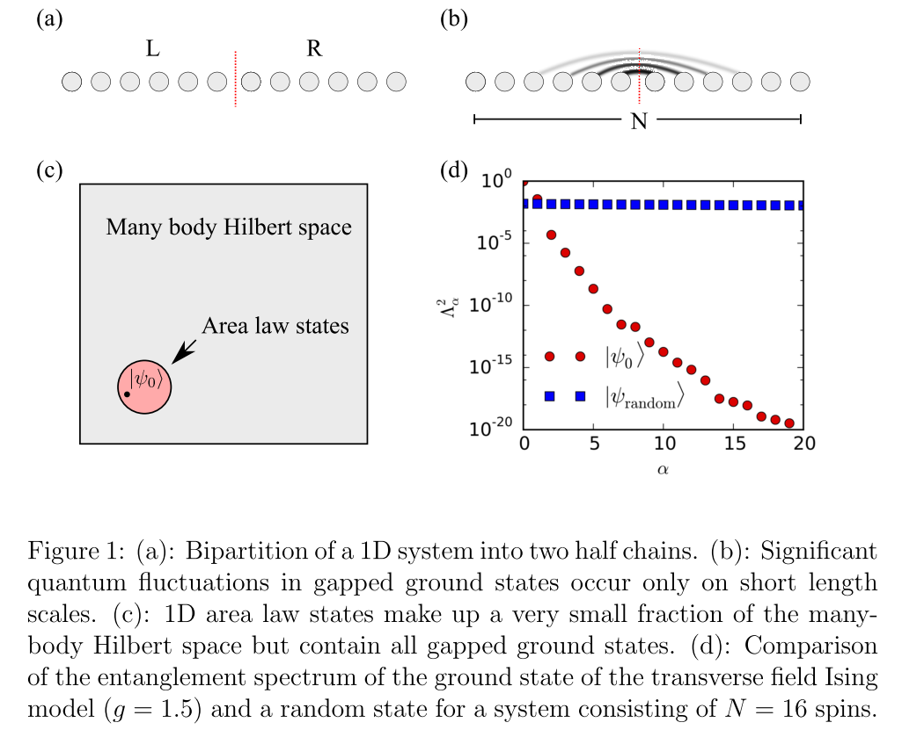

In these notes I try to collect some definitions, details, tricks and resources that are useful when implementing the DMRG algorithm. In particular those that I would have liked to seen explained somewhere in more detail during the development of my program. In other words, I write in these notes what I've learned after having been stuck on details for longer than I care to admit, with the hope of not having to get stuck again if I revisit the steps later. 


I loosely follows the steps in these articles

> [Schollwoeck, U. (2010). The density-matrix renormalization group in the age of matrix product states. Annals of Physics, 326(1), 96–192.](https://doi.org/10.1016/j.aop.2010.09.012)

> [Kjäll, J. A., Zaletel, M. P., Mong, R. S. K., Bardarson, J. H. & Pollmann, F. Phase diagram of the anisotropic spin-2 XXZ model: Infinite-system density matrix renormalization group study. *Phys. Rev. B* **87,** 235106 (2013).](https://link.aps.org/doi/10.1103/PhysRevB.87.235106)


but I begin by establishing some definitions and notation specific to my implementation.

# Notation

\begin{tcolorbox}[title={\centering{\Large{\textbf{Tensor Diagram Notation}}}}]
\begin{center}
	\begin{tabular}{l c >{\centering \arraybackslash}p{3cm} >{\centering \arraybackslash}p{4.5cm} }
	\toprule
	Object 		& Rank	& Index notation	& Diagram notation\\
	\toprule
  	Scalar		&	0	& $a$			& \tensorO{a}  \\
 	Vector		&	1 	& $a_i$			&\tensorI{a}{i}   \\
 	Dual Vector	&	1 	& $a_i^\intercal$& \tensorIdual{a}{i}   \\
 	Matrix		&	2 	& $A_{ij}$ 		& \tensorII{A}{i}{j}   \\
 	Tensor		&	3 	& $A^i_{jk}$ 	& \tensorIII{A}{i}{j}{k}   \\
 	Tensor		&	4 	& $A^{ij}_{kl}$ 	& \tensorIV{A}{i}{j}{k}{l}   \\
	\bottomrule
	\end{tabular}
\end{center}
\begin{center}
	%\centering
	\begin{tabular}{l c >{\centering \arraybackslash}p{4cm} >{\centering \arraybackslash}p{3.5cm} }
	\toprule
	Operation	&  Index notation	& Diagram notation & Resulting rank\\ 
	\toprule
  	Scalar product		& $\sum_i a_i b_i =  a^\intercal b$				& \tensorIdottensorI{a}{b} 			& 0 \\
 	Trace		 		& $\sum_i A_{ii } = \text{Tr}(A)$					&\tensorIITrace{A}		 			& 0   \\
 	Partial trace	 	& $\sum_k  A_{ik,jk}$								& \tensorIIPartialtrace{A}{}{}   		& 2\\
 	Two-index contraction	& $\sum_{m,n} A^{mn}_{ij} (B^{mn}_{kl})^\dagger$	& \tensorIVcontraction{A}{B^\dagger}{}{}{}{}{2}	& 4 \\
	\bottomrule
	\end{tabular}
\end{center}
\end{tcolorbox}


Latin letters are reserved for physical indices, and greek indices for bond indices. 

The order of indices in all tensors follows doesn't follow a rule other than what's most convenient for computations:


\begin{align}
\Lambda_{\alpha}{\beta} &=  \tensorII{\Lambda}{\alpha}{\beta} = \tensorII{\Lambda}{0}{1} \\
\Gamma^{i}_{\alpha\beta} &= \tensorIII{\Gamma}{i}{\alpha}{\beta} = \tensorIII{\Gamma}{0}{1}{2} \\
\end{align}

The tensor $\Theta^{ij}_{\alpha\beta}$, resulting from the merger of two sites, is subject to a Schmidt (SVD) decomposition, and therefore its indices are most conveniently ordered like

\begin{align}
\theta^{ij}_{\alpha\beta} &= \tensorIV{\Theta}{i}{j}{\alpha}{\beta} = \tensorIV{\Theta}{0}{2}{1}{3}
\end{align}

Finally we shall see MPO-type tensors, such as the Hamiltonian, with the following index order
\begin{align}
\mpoI{H}{\alpha}{\beta}{i}{j}  = \mpoI{H}{0}{1}{2}{3}.
\end{align}

In C++ these are objects of type  \lstinline[style=cppstyle]|Eigen::Tensor<Scalar,rank>;|, where `Scalar` is typically the same as `double` if the MPS is real, or `std::complex<double>` if it is complex.


# Model Hamiltonian: The Quantum Ising model
We study the 1D Ising model with a transverse field, given by the following Hamiltonian

$$
H = \frac{1}{2}\sum_{i} \left[ -J\sigma_i^z\sigma_{i+1}^z  -g\sigma_i^x \right].
$$
Naturally the transverse field can be put on the $z$ direction inststead:
$$
H = \frac{1}{2}\sum_{i} \left[ -J\sigma_i^x\sigma_{i+1}^x  -g\sigma_i^z \right].
$$


We can split the Hamiltonian into odd and even parts by introducing 
$$
\begin{aligned}
h_i &= -J\sigma_i^z\sigma_{i+1}^z -\frac{g}{2}(\sigma_i^x + \sigma_{i+1}^x)\\
h_j &= -J\sigma_j^z\sigma_{j+1}^z -\frac{g}{2}(\sigma_j^x + \sigma_{j+1}^x)
\end{aligned}
$$

such that the total Hamiltonian becomes
$$
H = \sum_{i\mathrm{\ even}} h_i + \sum_{j\mathrm{\ odd}} h_j,
$$


For two sites this can be written out explicitly
```{python, engine.path = '/usr/bin/python3'}
from numpy import *
from sympy import *
# pauli spin

I  = mat([[1, 0],[ 0, 1]])
sx = mat([[0, 1],[ 1, 0]])
sy = mat([[0, -1j],[1j, 0]])
sz = mat([[1, 0],[0, -1]])

SX1 = kron(sx,I); SX2 = kron(I,sx)
SZ1 = kron(sz,I); SZ2 = kron(I,sz)
J,g = symbols("J g")
h_evn = -J * SZ1*SZ2  - 0.5*g * (SX1 + SX2)
h_odd = -J * SZ2*SZ1  - 0.5*g * (SX2 + SX1)
print("ZZ X:")
pprint(Matrix(h_evn + h_odd))
h_evn = -J * SX1*SX2  - 0.5*g * (SZ1 + SZ2)
h_odd = -J * SX2*SX1  - 0.5*g * (SZ2 + SZ1)
print("XX Z:")
pprint(Matrix(h_evn + h_odd))
```


In DMRG++ it is obtained by calling `H()` in the following code:

\begin{c++}
std::vector<Eigen::MatrixXcd> gen_manybody_spin(const Eigen::Matrix2cd &s, int sites) {
    std::vector<Eigen::MatrixXcd> S;
    Eigen::MatrixXcd tmp;
    S.clear();
    for (int i = 0; i < sites; i++) {
        tmp = i == 0 ? s : I();
        for (int j = 1; j < sites; j++) {
            tmp = Eigen::kroneckerProduct(tmp, i == j ? s : I()).eval();
        }
        S.emplace_back(tmp);
    }
    return S;
}

Eigen::MatrixXcd h(int sites, int position) {
      int i = mod(position, sites);
      int j = mod(position + 1, sites);
      SX = gen_manybody_spin(sx(), sites);
      SY = gen_manybody_spin(sy(), sites);
      SZ = gen_manybody_spin(sz(), sites);
      return (-J * SX[i] * SX[j] - 0.5 * g * (SZ[i] + SZ[j]));
  }

Eigen::MatrixXcd H(int sites) {
      Eigen::MatrixXcd hi = Eigen::MatrixXcd::Zero((long) pow(2, sites), (long) pow(2, sites));
      for (int position = 0; position < sites; position++) {
          hi += h(sites, position);
      }
      return hi;
  }
\end{c++}

Here the `sx(), sy(), sz()` matrices are simply the $2\times2$ Pauli matrices in `Eigen` matrix type, and `h(sites,position)` generates the even/odd terms in the Hamiltonian as defined above. 


# Matrix Product States (MPS)
The state $|\psi\rangle$ of a 1D quantum many-body system with $n$ spin-$d$ particles $\sigma_1,\sigma_2,...,\sigma_n$ can in general be written as
\begin{align}
|\psi\rangle = \sum_{\sigma_1...\sigma_n} c_{\sigma_1...\sigma_n}|\sigma_1...\sigma_n\rangle,
\end{align}
with complex coefficients, (or amplitudes)  $c_{\sigma_1...\sigma_n}$, which together can be thought of as a rank-$n$ tensor. For a given configuration $|\sigma_1...\sigma_n\rangle$, a coefficient can be expressed as the product of matrices of the form $A^{\sigma_i} = (A^i)^{\sigma_i}_{\alpha_{i-1},\alpha_i}$, such that $c_{\sigma_1\sigma_2...\sigma_n} = A^{\sigma_1}_{1,\alpha_1}A^{\sigma_2}_{\alpha_1,\alpha_2}...A^{\sigma_n}_{\alpha_{n-1},\alpha_n}$, where each index $a_i$ runs from $i = 1$ to $i = \chi_i$. Each $(A^i)^{\sigma_i}_{\alpha_{i-1},\alpha_i}$ can therefore be interpreted as a rank-$3$ tensor, i.e. one $\chi_{i-1} \times \chi_i$ matrix for each possible value of $\sigma_i$.


Omitting the $\alpha$'s, the full state is therefore equivalently expressed as
\begin{align}
|\psi\rangle = \sum_{\sigma_1...\sigma_n} A^{\sigma_1}...A^{\sigma_n}|\sigma_1...\sigma_n\rangle,
\end{align}

In this reformulation we have effectively \textit{unfolded} a rank-$n$ tensor to a series of rank-$3$ tensors. In tensor diagram notation the unfolding reads
\begin{center}
$\tensorN{c}{\sigma_1}{\sigma_2}{\sigma_3}{\sigma_n}{2}  = \text{ } \mpsNobc{A^1}{A^2}{A^n}{\sigma_1}{\sigma_2}{\sigma_n}{2}$,
\end{center}


From this picture it is clear why $\chi_{i}$ is called the \textit{bond dimensions}, the dimension of of the contraction between $A$'s, which encodes the level of entanglement with the subsystems to the left or right of a thought bipartition at $i$. 


## Schmidt decomposition of an MPS
A singular value decomposition (SVD) operation splits a matrix into three: $M = U\Lambda V$. Here $U$ and $V$ are left/right unitary matrices and $\Lambda$ is a diagonal matrix with decreasing \textit{singular values} $\lambda_1, \lambda_2 > ... > \lambda_n$. A compressed matrix $\tilde{M} = \tilde{U} \tilde{\Lambda} \tilde{V}$ is obtained by discarding the smallest singular values, such that $\tilde{\Lambda} = \text{diag}[\lambda_1, ... ,\lambda_m]$ with $m<n$. The resulting matrix $\tilde{M}$ minimizes the Frobenius norm of $M-\tilde{M}$, making it a good approximation of $M$.

In MPS language the split is called a \textit{Schmidt decomposition}, which for a left/right bipartition of the Hilbert space $\mathcal{H} = \mathcal{H}_L\otimes \mathcal{H}_R$ can partition the state $|\psi \rangle$ into left $\{|\phi\rangle_{L}\} \in \mathcal{H}_{L}$ and right $\{|\phi\rangle_{R}\} \in \mathcal{H}_{R}$  parts
\begin{align}
|\psi\rangle = \sum_{k=1}^\chi \lambda_k |\phi\rangle_L \otimes |\phi\rangle_R.
\end{align}
connected by singular values $\lambda_k$ describing the \textit{entanglement spectrum} between the two subsystems. This is also called the \textit{Schmidt spectrum}. In diagrammatic notation
\begin{center}
\tensorBP{A}{\sigma}{\Lambda}{}{}{}
\end{center}
The singular values $\Lambda = \text{diag}[\lambda_1,...,\lambda_\chi]$, directly give us the \textit{entanglement entropy} 
\begin{align}
S_E = - \sum_{k=1}^\chi \lambda_k^2 \ln \lambda_k^2.
\end{align}


Discarding small $\lambda_k$ amounts to throwing away entanglement information. In practice one enforces an upper limit $\chi = \chi_{\text{max}}$ on the bond dimension.

## Properties of the entanglement spectrum
The success of the DMRG algorithm for 1D systems relies on the observation that the singular values decay fast if the system is gapped, exponentially in fact, and can be discarded if they are below some threshold. See the figure from Pollmann's article.

{ width=50% }


## MPS in Vidal's $\Gamma\Lambda$ notation.

## Canonical form


# Matrix Product Operators (MPO)

## Hamiltonian as an MPO

In MPO form the Hamiltonian of the quantum Ising model with a transverse field reads 

$$
H_{\text{MPO}} = 
\begin{pmatrix}
	I & 0 & 0 \\
	\sigma^z & 0 & 0 \\
	-g \sigma^x & -J \sigma^z & I
\end{pmatrix}.
$$

where each element is a $2\times 2$ -matrix.
To transform into an MPO note that this matrix is essentially an outer $(3\times 3)$ matrix containing inner $(2\times 2)$ matrices, or equivalently a $(2\times 3) \times (2 \times 3)$ matrix. The goal is to obtain an MPO with dimensions $(3,3,2,2)$, depicted as

\begin{align}
\mpoI{H}{0_{dim=3}}{1_{dim=3}}{2_{dim=2}}{3_{dim=2}} = \mpoI{H}{b_1}{b_2}{a_1}{a_2},
\end{align}
where the left figure indicates the numbering of the indices and also their dimension.

Returning to $H_{\text{MPO}}$, remember that it should follow column-major notation in C++, such that the left $(2\times 3)$ column is counted first. Calling these indices $(a_1 \times b_1)$, we note that $a_1$ should "tick"  before $b_1$. 
Likewise for the $(2\times 3)$ rows, denoted $(a_2 \times b_2)$, note that $a_2$ ticks before $b_2$.
Therefore to get a rank 4 MPO we should simply reshape into indices $(a_1,b_1,a_2,b_2) = (2,3,2,3)$.

Next we should reorder the indices to get the right diagram above. To do this, we do a transpose, or shuffle like $(1,3,0,2)$ to get the order of indices $(b_1,b_2,a_1,a_2) = (3,3,2,2)$. Then the first index $b_1$ selects the outer matrix row, and $b_2$ the outer matrix column, while $a_1$ selects inner row, and $a_2$ inner column. 


## Environments


## Expectation values using MPO's
The energy expectation value  $\langle \psi | H | \psi \rangle$ computed as 


\begin{align}
\langle E \rangle = \dmrgTwoSiteEnergy{\Lambda^A}{\Gamma^A}{\Lambda^B}{\Gamma^B}{L}{R}{H}{2}
\end{align}


# The iDMRG Algorithm
The two-site algorithm considers neighbouring sites $AB$ embedded in a chain of increasing length, n = 2,4,6.. At each iteration states are discarded to keep the Hilbert space size manageable. The chain is always represented by a block-site-site-block structure, $L\text{ } AB \text{ } R$, where $L$ and $R$ represent left/right environments. One iteration absorbs sites into the environments i.e. $LA \rightarrow L$ and $BR \rightarrow R$ and then inserts two new particles $AB$ in the middle. After a certain number of iterations the algorithm converges when a fix-point in Hilbert space is reached. The 4 steps involved in an iteration are shown below in tensor diagram notation.

\begin{center}
\begin{tcolorbox}[width=0.9\linewidth, title={\centering\large{\textbf{iDMRG}}}]
\begin{center}
	\begin{tabular}{l l c }
	\toprule
	Step 		& Operation	& Diagram\\
	\toprule
  	1		&	Merge 2 sites 	& \idmrgTwoSite{A}{\Lambda}{B} $\rightarrow$ \tensorIV{\Theta}{}{}{}{}{} \\
 	2		&	\vbox to 1em{\hbox{\shortstack[l]{Find smallest \\ eigenstate using \\ an iterative solver\\ $H\Theta = E_{GS}\Theta$} }\vss}			& \idmrgMPO{\Theta}{L}{R}{H} $\rightarrow$ $E_{GS}$\tensorIV{\Theta_{\text{GS}}}{}{}{}{}{}\\
 	3		&	\vbox to 1em{\hbox{\shortstack[l]{SVD\\ Split and keep only the \\ largest singular values} }\vss}						&  \tensorIV{\Theta_\text{GS}}{}{}{}{}{} $\xrightarrow{\text{SVD}} $  \idmrgTwoSite{\tilde{A}}{\tilde{\Lambda}}{\tilde{B}} \vspace{0.5cm} \\
 	4		&	Update environments	& \idmrgContractLeft {L}{A}{H}{2} $\rightarrow$ \idmrgLeft{L}{2} \hspace{1cm} \idmrgContractRight{R}{B^\dagger}{H}{2} $\rightarrow$ \idmrgRight{R}{2}   \\
 	5		& Swap $A$ and $B$ &  \\
	%\bottomrule
	\end{tabular}
\end{center}
\end{tcolorbox}
\end{center}

## Step 1. Merge two sites

In two-site DMRG, the first step merges the two sites around the bond at $i$ into one single tensor


$$
\Theta^{\sigma_i,\sigma_{i+1}}_{\alpha_{i-1},\alpha_{i+1}}
=
\sum_{\alpha_i} A^{\sigma_i}_{\alpha_{i-1},\alpha_i} \Lambda_{\alpha_{i},\alpha_{i}} B^{\sigma_{i+1}}_{\alpha_i,\alpha_{i+1}}
= 
\sum_{\alpha_i} \Lambda_{\alpha_{i-1},\alpha_{i-1}} \Gamma^{\sigma_i}_{\alpha_{i-1},\alpha_{1}} \Lambda_{\alpha_{i},\alpha_{i}} \Gamma^{\sigma_{i+1}}_{\alpha_{i},\alpha_{i+1}} \Lambda_{\alpha_{i+1},\alpha_{i+1}} 
$$


## Step 2. Finding the smallest eigenstate

## Step 3. Schmidt decomposition using SVD 

## Step 4. Update environments


# MPO with substracted expectation value

Computing the expecation value using $H = H_\text{MPO}$ as defined earlier yields the total energy of the entire chain, and one has to divide by the chain-length $L$ to get the per-site energy density. As $L$ grows this becomes problematic, for instance when calculating the variance $\mathrm{Var}H = \langle \Delta H \rangle = \langle (H - \langle H \rangle )^2\rangle = \langle H ^2\rangle - E^2$, as this would imply loss of precision when subtracting two very large numbers. [According to C. Hubig](http://arxiv.org/abs/1711.01104), the loss of precision incurred is approximately $\log_{10}(E^2)$ digits.


To remedy this one can use \textit{reduced} Hamiltonian where we subtract the current per-site energy $\langle e \rangle$ from the lower left corner of the MPO. Considering the $k$-th DMRG-step, we have $\tilde{H}_\mathrm{MPO}(k) = H_\mathrm{MPO} - \langle e \rangle_k I_{2\times2}$, where $\langle e \rangle_k I_{2\times2}$ is a diagonal matrix subtracted from the lower left corner. For instance, for the quantum Ising model the reduced Hamiltonian is

$$
\tilde H_{\text{MPO}}(k) = 
\begin{pmatrix}
	I & 0 & 0 \\
	\sigma^z & 0 & 0 \\
	-g \sigma^x - \langle e \rangle_k I & -J \sigma^z & I
\end{pmatrix}.
$$
Using this reduced version we obtain \textit{reduced} environments $\tilde L$ and $\tilde R$

\begin{align}
\idmrgContractLeftVidal {\tilde L (k-1)}{\Lambda^B}{\Gamma^A}{\tilde H(k)}{3} \rightarrow \idmrgLeft {\tilde L(k)}{2} \hspace{1cm} \idmrgContractRightVidal{\tilde R (k-1)}{\Gamma^B}{\Lambda^B}{\tilde H(k)}{3} \rightarrow \idmrgRight{\tilde R(k)}{2}
\end{align}

The per-site energy $\langle e \rangle_k$ has to be computed at each step using the original, non-reduced $H_\mathrm{MPO}$, together with the reduced environments:

\begin{align}
2\langle e \rangle_k = \dmrgTwoSiteEnergy{\Lambda^A}{\Gamma^A}{\Lambda^B}{\Gamma^B}{\tilde L(k-1)}{\tilde R(k-1)}{H}{2}.
\end{align}

### Practical considerations

\textbf{1)} We set $\langle e \rangle_0 = 0$, which implies $\tilde H_\text{MPO}(0) = H_\text{MPO}(0)$, $\tilde L (0) = L(0)$ and $\tilde R(0)= R(0)$.

\textbf{2)} At the $k$-th step $L(k)$ and $R(k)$ contain $k$ sites each, so the chain length is $L = 2k$. 

\textbf{3)} At the $k$-th step we have subtracted $\sum_{i=0}^{k} \langle e \rangle_i \approx k \langle e \rangle_k$ from $\tilde L(k)$ and $\tilde R(k)$.

\textbf{4)} The following relations can be used as a sanity check:
\begin{align}
0 = \dmrgTwoSiteEnergy{\Lambda^A}{\Gamma^A}{\Lambda^B}{\Gamma^B}{\tilde L(k-1)}{\tilde R(k-1)}{\tilde H(k)}{2} = \dmrgLRcontraction{\Lambda^A}{\tilde L(k)}{\tilde R(k)}{3}.
\end{align}


# Error measures

## Truncation error

The truncation error is perhaps the simplest measure of convergence, obtained at almost no cost from during the Schmidt decomposition. Recall that the singular values $\Lambda = \text{diag}[\lambda_1,...,\lambda_\chi]$ (sorted in decreasing order) gives us the \textit{entanglement entropy} 

\begin{align}
S_E = - \sum_{k=1}^{\chi_\text{max}} \lambda_k^2 \ln \lambda_k^2.
\end{align}

Where we have enforced an upper limit on the bond dimension $\chi = \chi_\text{max}$,  to keep the size of the MPS tractable. Enforcing this upper limit will essentially discard entanglement information from the MPS. The \textit{truncation error} $\epsilon(\chi_\text{max})$ is then defined as the discarded weight


\begin{align}
\epsilon(\chi_\text{max}) = \sum_{k > \chi_\text{max}} \lambda_k =  1 - \sum_{k = 1}^{\chi_\text{max}} \lambda_k.
\end{align}


## Energy Variance
The energy variance $\mathrm{Var}(H) = \langle (H - \langle H \rangle )^2\rangle = \langle H ^2\rangle - E^2$ signals how close a given MPS is to an eigenstate of the Hamiltonian, independently of implementation details, and as such it is a more robust alternative to the truncation error. The total variance is extensive, growing linearly with $L$, so in practice we want to measure the per-site variance $\mathrm{Var}(H) / L$, which should converge as $L\rightarrow\infty$.

There are four ways to compute the energy variance of an MPS, described in the following articles

1. Using a double-layer of MPO's
2. Using the local 2-site Hamiltonians
3. Using the moments calculated from the characteristic function of the transfer matrix
4. Using an approximation, the 2-site variance


### Variance from a double-layer of MPO's
An easy but costly way of obtaining the variance is by using a double layer of Hamiltonian MPO's to get the squared expectation value $\langle H^2 \rangle$.

\begin{align}
\langle H^2 \rangle = \dmrgTwoSiteVariance{\Lambda^A}{\Gamma^A}{\Lambda^B}{\Gamma^B}{L_2(k-1)}{R_2(k-1)}{H}{2} = \dmrgLLRRcontraction{\Lambda^A}{L_2(k)}{R_2(k)}{3}.
\end{align}


This method is costly because it requires us to keep track of a second set of environments $L_2$ and $R_2$, which need to be grown concurrently with $L$ and $R$. 

Because each term in $\langle H^2 \rangle - \langle E \rangle^2$ grows quadratically with $L$, the subtraction will quickly suffer from loss of precision, as discussed earlier. For this reason it is more convenient to work with the reduced quantities, and as a bonus we can obtain the variance directly from the definition $\mathrm{Var}(H) = \langle (H - \langle H \rangle )^2\rangle$ = $\langle \tilde H^2 \rangle$. 


\begin{align}
\text{Var}(H) = \dmrgTwoSiteVariance{\Lambda^A}{\Gamma^A}{\Lambda^B}{\Gamma^B}{\tilde L_2(k-1)}{\tilde R_2(k-1)}{\tilde H}{2} = \dmrgLLRRcontraction{\Lambda^A}{\tilde L_2(k)}{\tilde R_2(k)}{3}.
\end{align}


### Variance from local Hamiltonian

We can compute the variance by calculating the series for the squared Hamiltonian explicitly.

\begin{align}
\left\langle H ^2 \right\rangle &= \left\langle \left( \sum_{i=0}^L h_i \right)^2\right\rangle =  \left\langle \left( \sum_{i \text{ even}}^L h_i + \sum_{j \text{ odd}}^L h_j \right)^2\right\rangle \\
    &=\left\langle \left( \sum_{i \text{ even}}^L h_i\right) \left(\sum_{i' \text{ even}}^L h_{i'} \right)\right\rangle \text{\hspace{2cm}\textbf{I}}  \\
    &+\left\langle \left( \sum_{j \text{ odd }}^L h_j\right) \left(\sum_{j' \text{ odd }}^L h_{j'} \right)\right\rangle \text{\hspace{2cm}\textbf{II}} \\
    &+\left\langle \left( \sum_{i \text{ even}}^L h_i\right) \left(\sum_{j' \text{ odd }}^L h_{j'} \right)\right\rangle \text{\hspace{2cm}\textbf{III}}\\
    &+\left\langle \left( \sum_{j \text{ odd }}^L h_i\right) \left(\sum_{i' \text{ even}}^L h_{i'} \right)\right\rangle \text{\hspace{2cm}\textbf{IV}}
\end{align}

Below, each term \textbf{I}-\textbf{IV} can be further decomposed into
 
\begin{align}
\textbf{I}   &= \langle \sum_{i=i'} h_i h_{i'}  \rangle +  \langle \sum_{i-i' \geq 2} h_i h_{i'}  \rangle +  \langle \sum_{i'-i \geq 2} h_i h_{i'}  \rangle &= \textbf{I}_a + \textbf{I}_b + \textbf{I}_c \\
\textbf{II}  &= \langle \sum_{j=j'} h_j h_{j'}  \rangle +  \langle \sum_{j-j' \geq 2} h_j h_{j'}  \rangle +  \langle \sum_{j'-j \geq 2} h_i h_{i'}  \rangle &= \textbf{II}_a + \textbf{II}_b + \textbf{II}_c \\
\textbf{III} &= \langle \sum_{i+1=j'} h_i h_{j'}  \rangle +  \langle \sum_{i = j'+1} h_i h_{j'}  \rangle +  \langle \sum_{|i-j'| > 1} h_i h_{j'}  \rangle &= \textbf{III}_a + \textbf{III}_b + \textbf{III}_c \\
\textbf{IV}  &= \langle \sum_{j+1=i'} h_j h_{i'}  \rangle +  \langle \sum_{j = i'+1} h_j h_{i'}  \rangle +  \langle \sum_{|j-i'| > 1} h_j h_{i'}  \rangle &= \textbf{IV}_a + \textbf{IV}_b + \textbf{IV}_c 
\end{align}


To translate all these terms into tensor contractions, we need to introduce some definitions. Let  $T_e$ and $T_o$ be even and odd transfer matrices, defined as

\begin{align}
T_e &=\dmrgTransferMatrix{\Lambda^A}{\Gamma^A}{\Lambda^B}{\Gamma^B}{2} = \tensorIVcontraction{\Phi_e}{\Phi_e^\dagger}{}{}{}{}{2}   \\
T_o &=\dmrgTransferMatrix{\Lambda^B}{\Gamma^B}{\Lambda^A}{\Gamma^A}{2} = \tensorIVcontraction{\Phi_o}{\Phi_o^\dagger}{}{}{}{}{2} .  
\end{align}

Let also $l_e$, $r_e$, $l_o$ and $r_o$ be the left and right dominant eigenvectors for the transfer matrices, defined through the following eigenvalue equations: 

\begin{align}
\dmrgTransferMatrixLeft {\Lambda^A}{\Gamma^A}{\Lambda^B}{\Gamma^B}{l_e}{2} &= \eta_e \dmrgLeftEigenvector {l_e}{2} \\
\dmrgTransferMatrixRight{\Lambda^A}{\Gamma^A}{\Lambda^B}{\Gamma^B}{r_e}{2} &= \eta_e \dmrgRightEigenvector {r_e}{2}\\
\dmrgTransferMatrixLeft {\Lambda^B}{\Gamma^B}{\Lambda^A}{\Gamma^A}{l_o}{2} &= \eta_o \dmrgLeftEigenvector {l_o}{2} \\
\dmrgTransferMatrixRight{\Lambda^B}{\Gamma^B}{\Lambda^A}{\Gamma^A}{r_o}{2} &= \eta_o \dmrgRightEigenvector {r_o}{2}.
\end{align}

The transfer matrices can be rescaled so that their largest eigenvalue becomes one, by redefining $\Phi_e \rightarrow \Phi_e/\sqrt{\eta_e}$ and $\Phi_o \rightarrow \Phi_o/\sqrt{\eta_o}$, or equivalently $T_e \rightarrow T_e/\eta_e$ and $T_o \rightarrow T_o/\eta_o$. Furthermore the left and right eigenvectors should be normalized such that 


\begin{align}
\dmrgLeftRightEigenvectorNormalization{l_e}{r_e}{2} & = 1\\
\dmrgLeftRightEigenvectorNormalization{l_o}{r_o}{2} & = 1.
\end{align}


$$
\tilde h_e = h_\text{even} - \langle e\rangle_\text{even} \\ 
\tilde h_o = h_\text{odd} - \langle e\rangle_\text{odd}
$$


### Variance from characteristic functions

